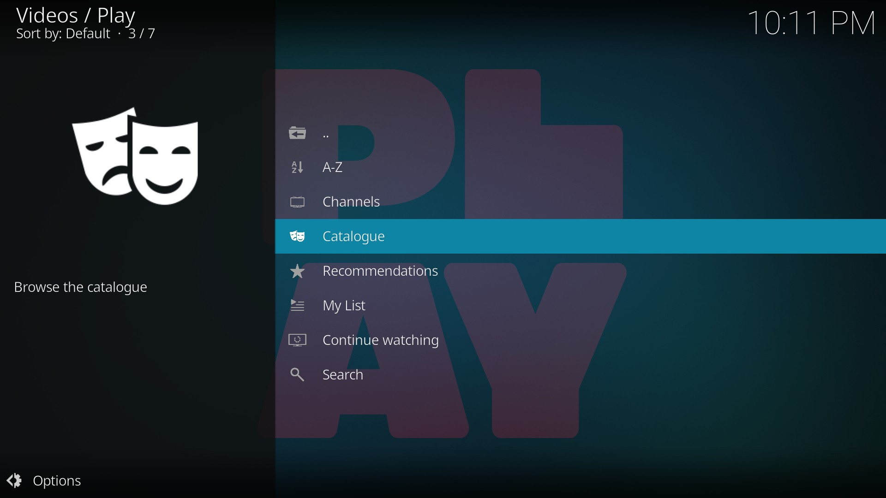
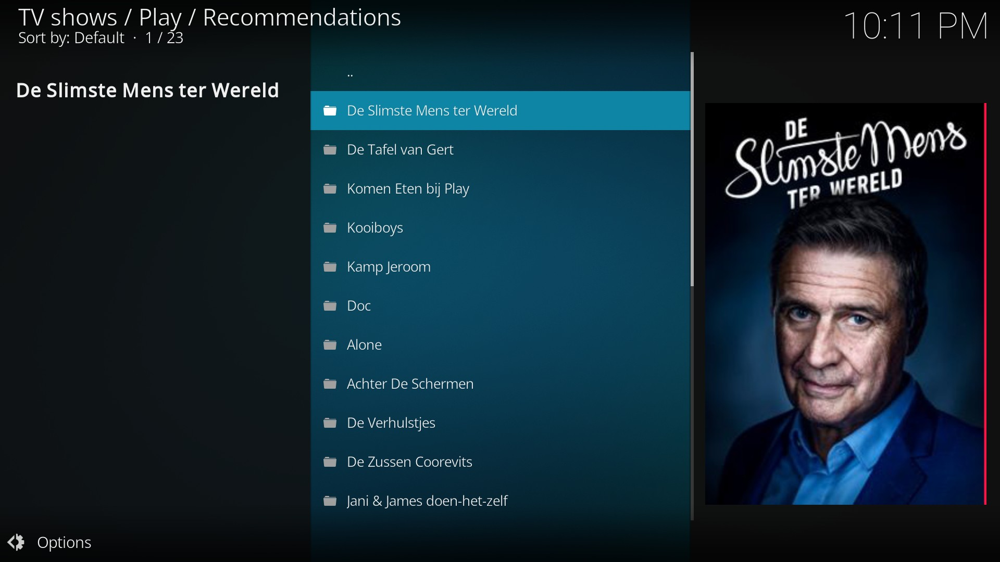
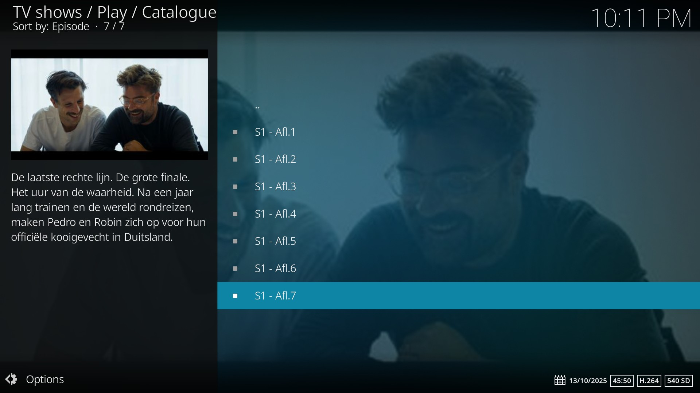

# Play Kodi add-on

*plugin.video.play* is een Kodi add-on om de video-on-demand content van [Play](https://www.play.tv/) te bekijken. Hiervoor dien je eerst een
account op [play.tv](https://www.play.tv/) aan te maken.

## Features

De volgende features worden ondersteund:
* Bekijk on-demand content van Play, Play Fictie, Play Actie, Play Reality en Play Crime
* Doorzoeken van alle programma's

## Screenshots

<table>
  <tr>
    <td></td>
    <td></td>
    <td></td>
  </tr>
 </table>

## Changelog
## [v0.6.0](https://github.com/add-ons/plugin.video.play/tree/v0.6.0) (2025-10-15)
- Play rebranding (@mediaminister)
